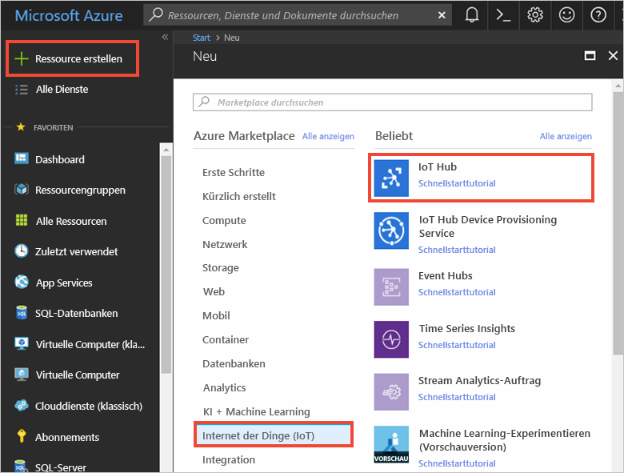
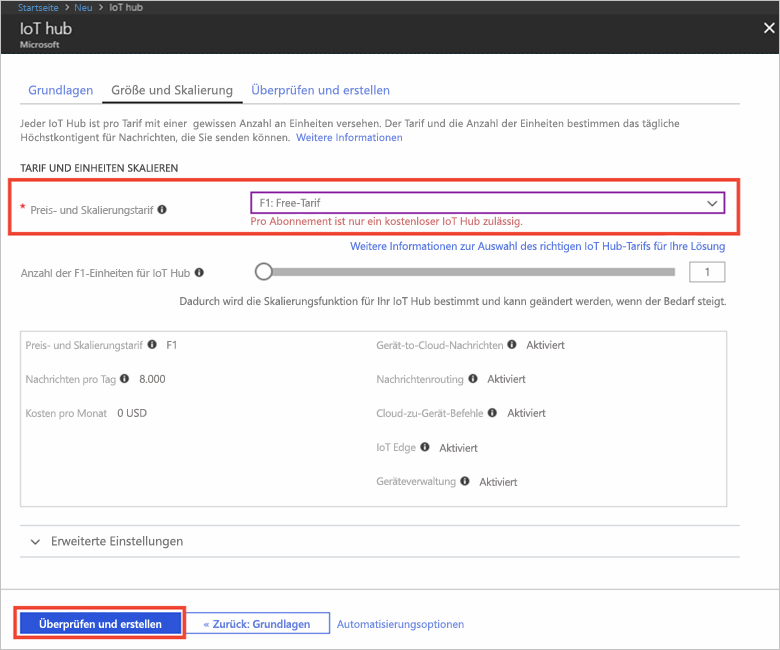

1. Melden Sie sich beim [Azure-Portal](https://portal.azure.com/) an.

2. Wählen Sie **Ressource erstellen** > **Internet der Dinge (IoT)** > **IoT Hub** aus.
   
    

3. Geben Sie im Bereich **IoT Hub** die folgenden Informationen für Ihren IoT Hub ein:

   * **Abonnement**: Wählen Sie das Abonnement aus, das Sie zum Erstellen dieses IoT-Hubs verwenden möchten.

   * **Ressourcengruppe**: Erstellen Sie eine Ressourcengruppe zum Hosten des IoT Hubs, oder verwenden Sie eine vorhandene. Weitere Informationen finden Sie unter [Verwenden von Ressourcengruppen zum Verwalten von Azure-Ressourcen](../articles/azure-resource-manager/resource-group-portal.md).

   * **Region**: Wählen Sie den nächstgelegenen Standort aus.

   * **Name**: Erstellen Sie einen Namen für Ihren IoT-Hub. Wenn der eingegebene Name verfügbar ist, wird ein grünes Häkchen angezeigt.

   [!INCLUDE [iot-hub-pii-note-naming-hub](iot-hub-pii-note-naming-hub.md)]

   

4. Klicken Sie auf **Next: Size and scale** (Nächster Schritt: Größe festlegen und skalieren), um die Erstellung Ihres IoT-Hubs fortzusetzen. 

5. Wählen Sie eine Option für **Tarif und Skalierung** aus. Legen Sie für diesen Artikel den Tarif **F1 – Free** fest, wenn er für Ihr Abonnement noch verfügbar ist. Weitere Informationen hierzu finden Sie unter [Tarif und Skalierung](https://azure.microsoft.com/pricing/details/iot-hub/).

   

6. Klicken Sie auf **Überprüfen + erstellen**.

7. Überprüfen Sie die Informationen zum IoT-Hub, und klicken Sie auf **Erstellen**. Die Erstellung des IoT Hubs kann mehrere Minuten dauern. Sie können den Fortschritt im Bereich **Benachrichtigungen** überwachen.