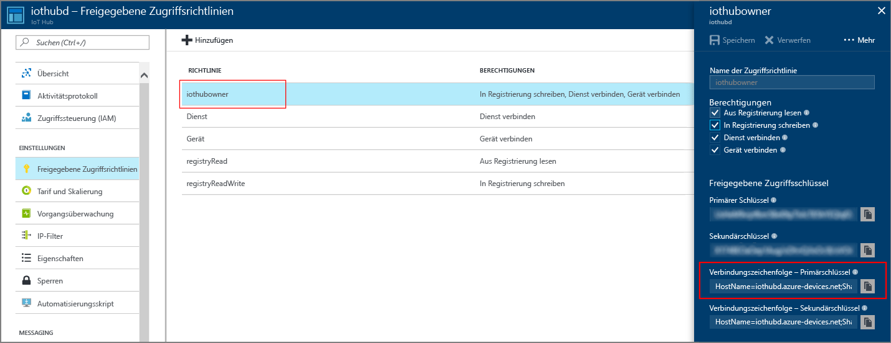

## Erstellen eines IoT Hubs
Erstellen Sie einen IoT-Hub, mit dem Ihre simulierte Geräte-App verbunden werden kann. Die folgenden Schritte veranschaulichen, wie Sie diese Aufgabe mit dem Azure-Portal ausführen.

1. Melden Sie sich beim [Azure-Portal](https://portal.azure.com/) an.

2. Wählen Sie **Ressource erstellen** > **Internet der Dinge (IoT)** > **IoT Hub** aus.
   
    

3. Geben Sie im Bereich **IoT Hub** die folgenden Informationen für Ihren IoT Hub ein:

   * **Abonnement**: Wählen Sie das Abonnement aus, das Sie zum Erstellen dieses IoT-Hubs verwenden möchten.

   * **Ressourcengruppe**: Erstellen Sie eine Ressourcengruppe zum Hosten des IoT Hubs, oder verwenden Sie eine vorhandene. Weitere Informationen finden Sie unter [Verwenden von Ressourcengruppen zum Verwalten von Azure-Ressourcen](../articles/azure-resource-manager/resource-group-portal.md).

   * **Region**: Wählen Sie den nächstgelegenen Standort aus.

   * **Name**: Erstellen Sie einen Namen für Ihren IoT-Hub. Wenn der eingegebene Name verfügbar ist, wird ein grünes Häkchen angezeigt.

   [!INCLUDE [iot-hub-pii-note-naming-hub](iot-hub-pii-note-naming-hub.md)]

   

4. Klicken Sie auf **Next: Size and scale** (Nächster Schritt: Größe festlegen und skalieren), um die Erstellung Ihres IoT-Hubs fortzusetzen. 

5. Wählen Sie eine Option für **Tarif und Skalierung** aus. Legen Sie für diesen Artikel den Tarif **F1 – Free** fest, wenn er für Ihr Abonnement noch verfügbar ist. Weitere Informationen hierzu finden Sie unter [Tarif und Skalierung](https://azure.microsoft.com/pricing/details/iot-hub/).

   

6. Klicken Sie auf **Überprüfen + erstellen**.

7. Überprüfen Sie die Informationen zum IoT-Hub, und klicken Sie auf **Erstellen**. Die Erstellung des IoT Hubs kann mehrere Minuten dauern. Sie können den Fortschritt im Bereich **Benachrichtigungen** überwachen.

8. Wenn Ihre neue IoT Hub-Instanz bereit ist, klicken Sie im Azure-Portal auf die entsprechende Kachel, um das Eigenschaftenfenster zu öffnen. Nachdem Sie nun einen IoT Hub erstellt haben, können Sie nach den wichtigen Informationen suchen, die Sie zum Herstellen einer Verbindung für Geräte und Anwendungen mit Ihrem IoT Hub nutzen. Klicken Sie auf **SAS-Richtlinien**.
   
9. Wählen Sie unter **Freigegebene Zugriffsrichtlinien** die Richtlinie **iothubowner** aus. Kopieren Sie unter **Verbindungszeichenfolge – Primärschlüssel** den IoT Hub-Primärschlüssel zur späteren Verwendung. Weitere Informationen finden Sie unter [Zugriffssteuerung](../articles/iot-hub/iot-hub-devguide-security.md) im „Entwicklerhandbuch für Azure IoT Hub“.
   
    