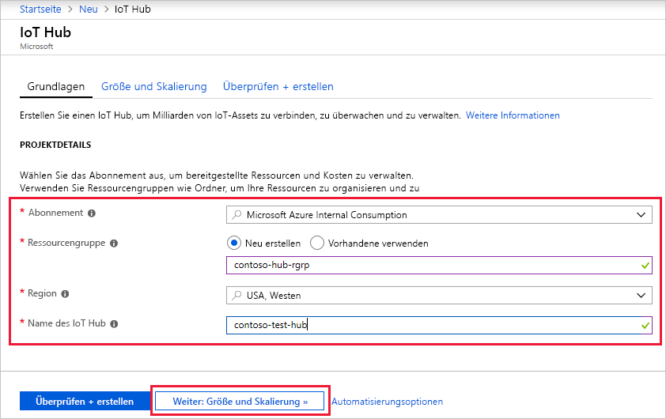
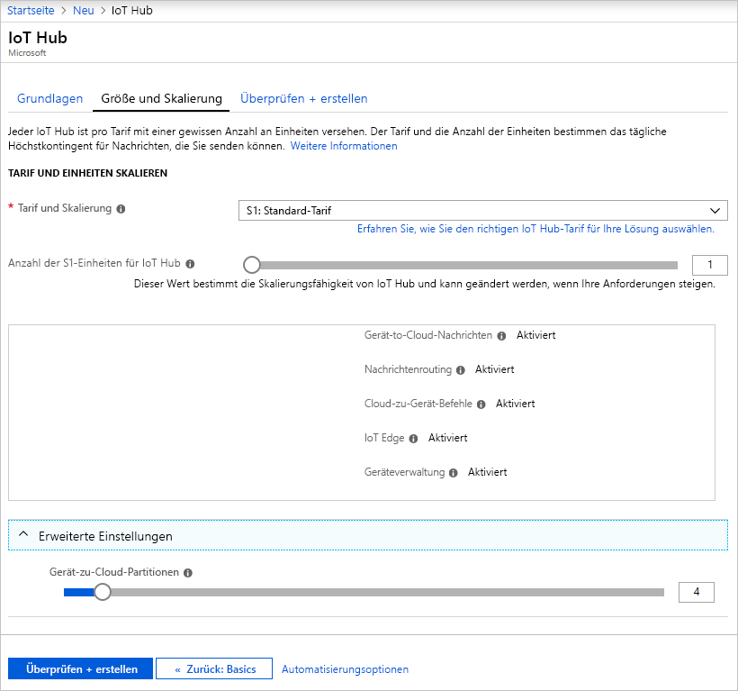
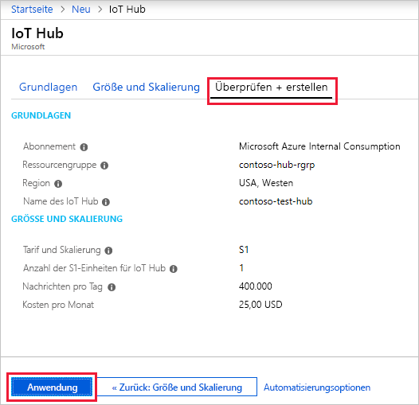

In diesem Abschnitt wird beschrieben, wie Sie über das [Azure-Portal](https://portal.azure.com) einen IoT-Hub erstellen:

1. Melden Sie sich beim [Azure-Portal](https://portal.azure.com)an. 

2. Wählen Sie +**Ressource erstellen**, und wählen Sie dann **Internet der Dinge**.

3. Klicken Sie in der Liste auf der rechten Seite auf **Iot Hub**. Daraufhin wird Ihnen der erste Bildschirm zum Erstellen eines IoT-Hubs angezeigt.

   

   Füllen Sie die Felder aus.

   **Abonnement**: Wählen Sie das Abonnement aus, das Sie für Ihren IoT-Hub verwenden möchten.

   **Ressourcengruppe**: Sie können eine neue Ressourcengruppe erstellen oder eine bereits vorhandene Ressourcengruppe verwenden. Um eine neue Ressourcengruppe zu erstellen, klicken Sie auf **Neu erstellen**, und geben Sie den Namen ein, den Sie verwenden möchten. Um eine vorhandene Ressourcengruppe zu verwenden, klicken Sie auf **Vorhandene verwenden**, und wählen Sie die Ressourcengruppe in der Dropdownliste aus. Weitere Informationen finden Sie unter [Verwalten von Azure Resource Manager-Ressourcengruppen](../articles/azure-resource-manager/manage-resource-groups-portal.md).

   **Region**: Die Region, in der sich Ihr Hub befinden soll. Wählen Sie in der Dropdownliste den am nächsten gelegenen Standort aus.

   **IoT Hub-Name**: Geben Sie den Namen für Ihren IoT-Hub ein. Dieser Name muss global eindeutig sein. Wenn der eingegebene Name verfügbar ist, wird ein grünes Häkchen angezeigt.

   [!INCLUDE [iot-hub-pii-note-naming-hub](iot-hub-pii-note-naming-hub.md)]

4. Klicken Sie auf **Weiter: Größe und Skalierung**, um die Erstellung Ihres IoT-Hubs fortzusetzen.

   

   Auf diesem Bildschirm können Sie die Standardeinstellungen übernehmen und im unteren Bereich einfach auf **Überprüfen + erstellen** klicken. 

   **Tarif und Skalierung**: Ihnen stehen abhängig davon, wie viele Features Sie wünschen, und wie viele Nachrichten Sie über Ihre Lösung pro Tag senden möchten, mehrere Tarife zur Auswahl. Der kostenlose Tarif ist für Test und Bewertung vorgesehen. Damit kann für 500 Geräte eine Verbindung mit dem IoT Hub hergestellt werden, und bis zu 8.000 Nachrichten pro Tag sind möglich. Jedes Azure-Abonnement kann einen IoT Hub im kostenlosen Tarif erstellen. 

   **IoT Hub-Einheiten**: Die Anzahl der pro Einheit und Tag zulässigen Nachrichten hängt von Ihrem Hubtarif ab. Beispiel: Wenn der IoT Hub 700.000 eingehende Nachrichten unterstützen soll, wählen Sie zwei Einheiten des Tarifs S1.

   Einzelheiten zu den anderen Tarifoptionen finden Sie unter [Skalieren einer IoT Hub-Lösung](../articles/iot-hub/iot-hub-scaling.md).

   **Erweitert/Gerät-zu-Cloud-Partitionen**: Diese Eigenschaft setzt die Gerät-zu-Cloud-Nachrichten in Relation zur Anzahl von gleichzeitigen Lesern der Nachrichten. Die meisten IoT-Hubs benötigen nur vier Partitionen. 

5. Klicken Sie auf **Überprüfen + erstellen**, um Ihre Auswahl zu überprüfen. Die Anzeige entspricht in etwa dem folgenden Bildschirm.

   

6. Klicken Sie auf **Erstellen**, um Ihren neuen IoT-Hub zu erstellen. Das Erstellen des Hubs dauert einige Minuten.
