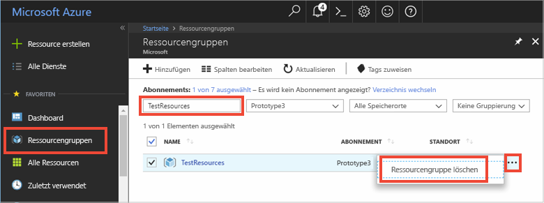

Falls Sie mit dem nächsten empfohlenen Artikel fortfahren möchten, können Sie die bereits erstellten Ressourcen behalten und wiederverwenden.

Andernfalls können Sie die in diesem Artikel erstellten Azure-Ressourcen löschen, um Kosten zu vermeiden. 

> [!IMPORTANT]
> Das Löschen einer Ressourcengruppe kann nicht rückgängig gemacht werden. Die Ressourcengruppe und alle darin enthaltenen Ressourcen werden unwiderruflich gelöscht. Achten Sie daher darauf, dass Sie nicht versehentlich die falsche Ressourcengruppe oder die falschen Ressourcen löschen. Wenn Sie die IoT Hub-Ressource in einer bereits vorhandenen Ressourcengruppe erstellt haben, die Ressourcen enthält, die Sie behalten möchten, löschen Sie nicht die Ressourcengruppe, sondern nur die IoT Hub-Ressource.
>

So löschen Sie eine Ressourcengruppe anhand des Namens:

1. Melden Sie sich beim [Azure-Portal](https://portal.azure.com) an, und klicken Sie auf **Ressourcengruppen**.

2. Geben Sie im Textfeld **Nach Name filtern...** den Namen der Ressourcengruppe ein, die Ihre IoT Hub-Ressource enthält. 

3. Klicken Sie in der Ergebnisliste rechts neben Ihrer Ressourcengruppe auf **...** und dann auf **Ressourcengruppe löschen**.

    

4. Sie werden aufgefordert, das Löschen der Ressourcengruppe zu bestätigen. Geben Sie zur Bestätigung erneut den Namen Ihrer Ressourcengruppe ein, und klicken Sie anschließend auf **Löschen**. Daraufhin werden die Ressourcengruppe und alle darin enthaltenen Ressourcen gelöscht.