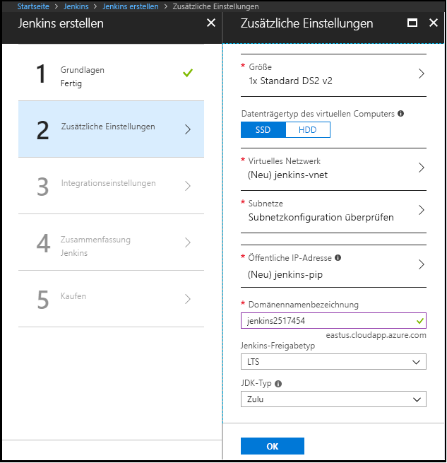

1. Öffnen Sie in Ihrem Browser das [Azure Marketplace-Image für Jenkins](https://azuremarketplace.microsoft.com/marketplace/apps/azure-oss.jenkins?tab=Overview).

1. Wählen Sie **Jetzt herunterladen** aus.

    

1. Nachdem Sie die Preisdetails und die Nutzungsbedingungen überprüft haben, wählen Sie **Weiter** aus.

    

1. Wählen Sie **Erstellen** aus, um den Jenkins-Server im Azure-Portal zu konfigurieren. 

    

1. Geben Sie auf der Registerkarte **Grundlagen** die folgenden Werte an:

   - **Name**: Geben Sie `Jenkins` ein.
   - **Benutzername**: Geben Sie den Benutzernamen ein, der für die Anmeldung bei dem virtuellen Computer verwendet wird, auf dem Jenkins ausgeführt wird. Der Benutzername muss [bestimmte Anforderungen](/azure/virtual-machines/linux/faq#what-are-the-username-requirements-when-creating-a-vm) erfüllen.
   - **Authentifizierungstyp**: Wählen Sie **Öffentlicher SSH-Schlüssel** aus.
   - **Öffentlicher SSH-Schlüssel**: Kopieren Sie einen öffentlichen RSA-Schlüssel im einzeiligen Format (beginnend mit `ssh-rsa`) oder im mehrzeiligen PEM-Format, und fügen Sie ihn ein. Sie können die SSH-Schlüssel mithilfe von „ssh-keygen“ unter Linux und macOS oder „PuTTYGen“ unter Windows generieren. Weitere Informationen zu SSH-Schlüsseln und Azure finden Sie im Artikel [Verwenden von SSH-Schlüsseln mit Windows in Azure](/azure/virtual-machines/linux/ssh-from-windows).
   - **Abonnement**: Wählen Sie das Azure-Abonnement aus, für das Jenkins installiert werden soll.
   - **Ressourcengruppe**: Wählen Sie **Neu erstellen** aus, und geben Sie einen Namen für die Ressourcengruppe ein, die als logischer Container für die Sammlung von Ressourcen dient, aus denen Ihre Jenkins-Installation besteht.
   - **Standort**: Wählen Sie **USA, Osten** aus.

     

1. Wählen Sie **OK** aus, um mit der Registerkarte **Zusätzliche Einstellungen** fortzufahren. 

1. Geben Sie auf der Registerkarte **Zusätzliche Einstellungen** die folgenden Werte an:

   - **Größe**: Wählen Sie die geeignete Option für die Größenanpassung für den virtuellen Jenkins-Computer aus.
   - **VM-Datenträgertyp**: Geben Sie entweder HDD (Festplattenlaufwerk) oder SSD (Solid-State Drive) als den Speichertyp an, der für den virtuellen Jenkins-Computer zulässig ist.
   - **Virtuelles Netzwerk**: (Optional) Wählen Sie **Virtuelles Netzwerk** aus, um die Standardeinstellungen zu ändern.
   - **Subnetze**: Wählen Sie **Subnetze** aus, überprüfen Sie die Informationen, und wählen Sie **OK** aus.
   - **Öffentliche IP-Adresse**: Der IP-Adressname ist standardmäßig der Jenkins-Name, den Sie auf der vorherigen Seite mit dem Suffix „-IP“ angegeben haben. Sie können die Option auswählen, um diesen Standardwert zu ändern.
   - **Domänennamenbezeichnung**: Geben Sie den Wert für die vollqualifizierte URL zum virtuellen Jenkins-Computer an.
   - **Jenkins-Releasetyp**: Wählen Sie den gewünschten Releasetyp aus den Optionen aus: `LTS`, `Weekly build` oder `Azure Verified`. Die Optionen `LTS` und `Weekly build` werden in diesem Artikel erläutert: [Jenkins LTS Release Line](https://jenkins.io/download/lts/) (Jenkins LTS-Releases). Die Option `Azure Verified` bezieht sich auf eine [Jenkins LTS-Version](https://jenkins.io/download/lts/), die für die Ausführung auf Azure überprüft wurde. 
   - **JDK Type** (JDK-Typ): Das zu installierende JDK. Standardmäßig werden getestete und zertifizierte Zulu-Builds von OpenJDK verwendet.

     

1. Wählen Sie **OK** aus, um mit der Registerkarte **Integrationseinstellungen** fortzufahren.

1. Geben Sie auf der Registerkarte **Integrationseinstellungen** die folgenden Werte an:

    - **Dienstprinzipal**: Der Dienstprinzipal wird als Anmeldeinformationen zur Authentifizierung bei Azure zu Jenkins hinzugefügt. `Auto` bedeutet, dass der Prinzipal durch MSI (Managed Service Identity, verwaltete Dienstidentität) erstellt wird. `Manual` bedeutet, dass der Prinzipal von Ihnen erstellt werden muss. 
        - **Anwendungs-ID** und **Geheimnis**: Wenn Sie die Option `Manual` für **Dienstprinzipal** auswählen, müssen Sie `Application ID` und `Secret` für Ihren Dienstprinzipal angeben. Wenn Sie [einen Dienstprinzipal erstellen](/cli/azure/create-an-azure-service-principal-azure-cli), beachten Sie, dass die Standardrolle **Mitwirkender** ist. Dies ist ausreichend für die Arbeit mit Azure-Ressourcen.
    - **Cloud-Agents aktivieren**: Geben Sie die Standardvorlage für die Cloud für Agents an. Dabei bezieht sich `ACI` auf die Azure-Containerinstanz und `VM` auf virtuelle Computer. Sie können auch `No` angeben, wenn Sie keinen Cloud-Agent aktivieren möchten.

1. Wählen Sie **OK** aus, um mit der Registerkarte **Zusammenfassung** fortzufahren.

1. Wenn die Registerkarte **Zusammenfassung** angezeigt wird, werden die eingegebenen Informationen überprüft. Wenn die Meldung **Überprüfung erfolgreich** (oben auf der Registerkarte) angezeigt wird, wählen Sie **OK** aus. 

     

1. Wenn die Registerkarte **Erstellen** angezeigt wird, wählen Sie **Erstellen** aus, um den virtuellen Computer für Jenkins zu erstellen. Wenn Ihr Server bereit ist, wird im Azure-Portal eine entsprechende Benachrichtigung angezeigt.

     
