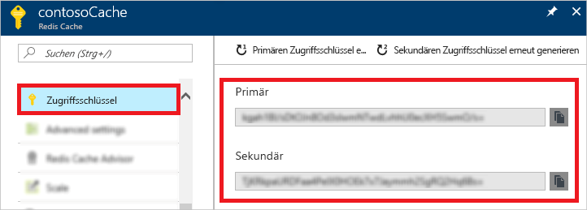
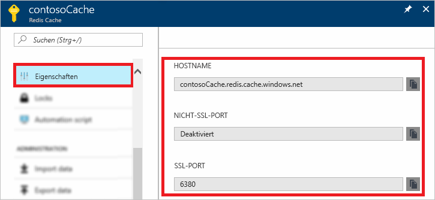

### Abrufen von Hostname, Ports und Zugriffsschlüsseln mit dem Azure-Portal

Wenn Sie eine Verbindung mit einer Azure Redis Cache-Instanz herstellen, benötigen Cacheclients den Hostnamen, die Ports und einen Schlüssel für den Cache. Von einigen Clients wird unter Umständen mit etwas anderen Namen auf diese Elemente verwiesen. Diese Informationen können Sie im Azure-Portal abrufen.

#### Abrufen der Zugriffsschlüssel und des Hostnamens

1. Zum Abrufen der Zugriffsschlüssel über das [Azure-Portal](https://portal.azure.com) navigieren Sie zu Ihrem Cache und klicken auf **Zugriffsschlüssel**. 

    

2. Klicken Sie zum Abrufen des Hostnamens und der Ports auf **Eigenschaften**.

    

