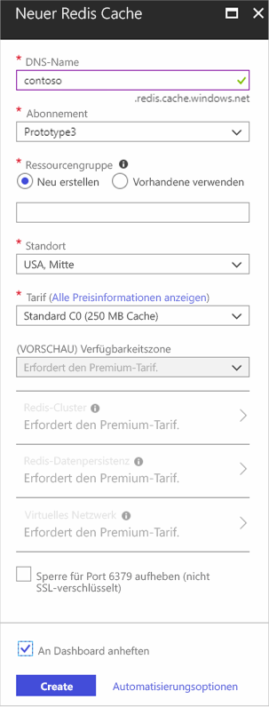
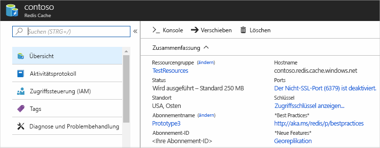

Zum Erstellen eines Caches zuerst melden Sie sich bei der [Azure-Portal](https://portal.azure.com), und klicken Sie auf **neu** > **Datenbanken** > **Redis-Cache**.

> [!NOTE]
> Wenn Sie nicht über ein Azure-Konto verfügen, können Sie [öffnen Sie ein Azure-Konto kostenlos](https://azure.microsoft.com/pricing/free-trial/?WT.mc_id=redis_cache_hero) in wenigen Minuten.
> 
> 

> [!NOTE]
> Zusätzlich zur Erstellung von Caches im Azure-Portal, Sie können auch erstellen sie mithilfe der Ressourcen-Manager-Vorlagen, PowerShell oder Azure-CLI.
> 
> * Um einen Cache mit Ressourcen-Manager-Vorlagen erstellen, finden Sie unter [einen Redis Cache mithilfe einer Vorlage erstellen](../articles/redis-cache/cache-redis-cache-arm-provision.md).
> * Um einen Cache mit Azure PowerShell erstellen, finden Sie unter [Verwalten von Azure Redis Cache mithilfe von Azure PowerShell](../articles/redis-cache/cache-howto-manage-redis-cache-powershell.md).
> * Um einen Cache mit Azure-CLI erstellen möchten, finden Sie unter [zum Erstellen und Verwalten von Azure Redis Cache mithilfe der Azure-Befehlszeilenschnittstelle (CLI zu Azure)](../articles/redis-cache/cache-manage-cli.md).
> 
> 

In der **neuer Redis Cache** Blatt, geben Sie die gewünschte Konfiguration für den Cache.

 

* In **DNS-Namen**, geben Sie einen eindeutigen Cache ein, die für die Cache-Endpunkt verwendet. Der Cachename muss eine Zeichenfolge zwischen 1 und 63 Zeichen lang sein und nur Ziffern, Buchstaben enthalten und die `-` Zeichen. Der Cachename darf nicht beginnen oder enden die `-` Zeichen- und aufeinander folgende `-` Zeichen sind nicht gültig.
* Für **Abonnement**, wählen Sie das Azure-Abonnement, das Sie für den Cache verwenden möchten. Wenn Ihr Konto nur über ein Abonnement verfügt, wird automatisch ausgewählt und die **Abonnement** Dropdown-Liste nicht angezeigt.
* In **Ressourcengruppe**Auswahl, oder erstellen Sie eine Ressourcengruppe für Ihren Cache. Weitere Informationen finden Sie unter [mithilfe von Ressourcengruppen zum Verwalten Ihrer Azure-Ressourcen](../articles/azure-resource-manager/resource-group-overview.md). 
* Verwendung **Speicherort** an welchem geografischen Standort, in dem gehosteten Caches. Für die optimale Leistung empfiehlt Microsoft dringend, den Cache in der gleichen Region wie die cacheclientanwendung zu erstellen.
* Verwendung **Tarif** um die gewünschte Cachegröße und Features auszuwählen.
* **Redis-Cluster** können Sie über mehrere Redis-Knoten Caches größer als 53 GB oder Shard-Daten zu erstellen. Weitere Informationen finden Sie unter [konfigurieren für einen Premium Azure-Redis-Cache clustering](../articles/redis-cache/cache-how-to-premium-clustering.md).
* **Redis-Persistenz** bietet die Möglichkeit, Ihr Cache in Azure Storage-Konto persistent speichern. Anweisungen zum Konfigurieren der Persistenz, finden Sie unter [Persistenz für einen Premium Azure-Redis-Cache konfigurieren](../articles/redis-cache/cache-how-to-premium-persistence.md).
* **Virtuelles Netzwerk** bietet verbesserte Sicherheit und Isolierung durch Einschränken des Zugriffs auf den Cache, damit nur die Clients innerhalb des angegebenen virtuellen Azure-Netzwerks. Alle Funktionen von VNet z. B. Subnetze, Zugriffssteuerungsrichtlinien, verwendet werden können, und andere Features zur weiteren Beschränken des Zugriffs auf Redis. Weitere Informationen finden Sie unter [Virtual Network-Unterstützung für einen Premium Azure-Redis-Cache konfigurieren](../articles/redis-cache/cache-how-to-premium-vnet.md).
* Nicht-SSL-Zugriff ist standardmäßig für neue Caches deaktiviert. Überprüfen Sie zum Aktivieren von nicht-SSL-Port **Blockierung von Port 6379 (keine SSL-verschlüsselte)**.

Sobald die neue Cacheoptionen konfiguriert sind, klicken Sie auf **erstellen**. Es dauert einige Minuten, bis der Cache erstellt werden soll. Um den Status zu überprüfen, können Sie den Status auf das Startmenü anzuheften überwachen. Nachdem der Cache erstellt wurde, hat der neue Cache eine **ausführen** Status und ist bereit für die Verwendung mit [Standardeinstellungen](../articles/redis-cache/cache-configure.md#default-redis-server-configuration).

