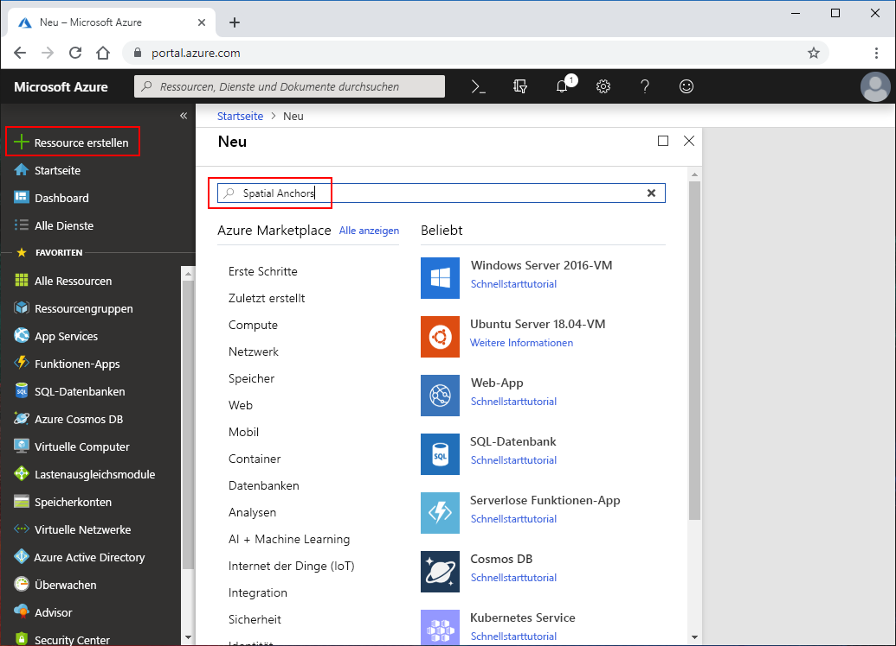
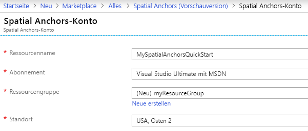
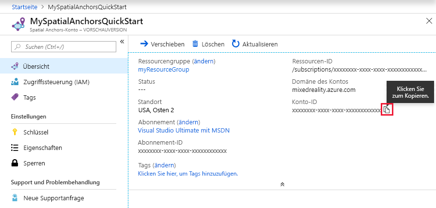
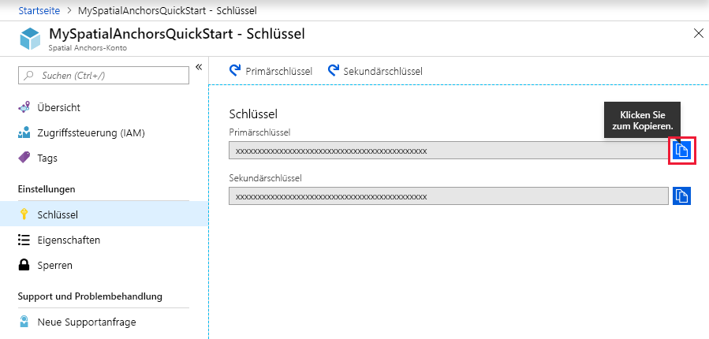

## Erstellen einer Spatial Anchors-Ressource

Öffnen Sie das <a href="https://portal.azure.com" target="_blank">Azure-Portal</a>.

Wählen Sie im linken Navigationsbereich des Azure-Portals die Option **Ressource erstellen** aus.

Suchen Sie über das Suchfeld nach **Spatial Anchors**.

   

Wählen Sie **Spatial Anchors** aus. Wählen Sie im Dialogfeld die Option **Erstellen** aus.

Gehen Sie im Dialogfeld **Spatial Anchors-Konto** wie folgt vor:

- Geben Sie einen eindeutigen Ressourcennamen in regulären alphanumerischen Zeichen ein.
- Wählen Sie das Abonnement aus, an das die Ressource angefügt werden soll.
- Erstellen Sie eine Ressourcengruppe durch Auswählen von **Neu erstellen**. Nennen Sie sie **myResourceGroup**, und wählen Sie **OK** aus.
      [!INCLUDE [resource group intro text](resource-group.md)]
- Wählen Sie einen Standort (Region) für die Ressource aus.
- Wählen Sie **Neu** aus, um mit der Ressourcenerstellung zu beginnen.

   

Nachdem die Ressource erstellt wurde, zeigt das Azure-Portal an, dass die Bereitstellung abgeschlossen ist. Klicken Sie auf **Zu Ressource wechseln**.

Anschließend können Sie die Ressourceneigenschaften anzeigen. Kopieren Sie den Wert für **Konto-ID** der Ressource in einen Text-Editor, da Sie ihn später benötigen.

   

Wählen Sie unter **Einstellungen** die Option **Schlüssel** aus. Kopieren Sie den Wert für **Primärschlüssel** in einen Text-Editor. Dieser Wert ist der `Account Key`. Sie benötigen die Information später.

   
