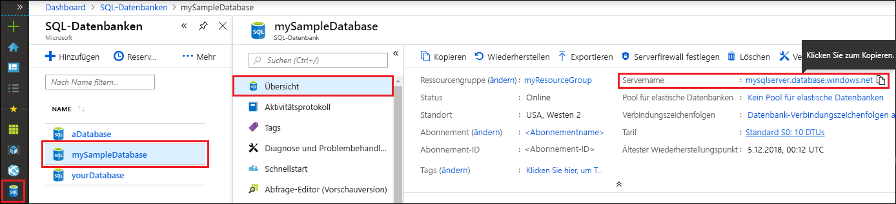

<!-- sql-database-connect-query-prerequisites-server-connection-info-includes.md 

## SQL server connection information
-->

Rufen Sie die Verbindungsinformationen ab, die zum Herstellen einer Verbindung mit der Azure SQL-Datenbank erforderlich sind. In den weiteren Verfahren benötigen Sie den vollqualifizierten Servernamen, den Datenbanknamen und die Anmeldeinformationen.

1. Melden Sie sich beim [Azure-Portal](https://portal.azure.com/) an.
2. Wählen Sie im Menü auf der linken Seite die Option **SQL-Datenbanken**, und klicken Sie auf der Seite **SQL-Datenbanken** auf Ihre Datenbank. 
3. Überprüfen Sie auf der Seite **Übersicht** für Ihre Datenbank den vollqualifizierten Servernamen wie in der folgenden Abbildung dargestellt. Sie können auf den Servernamen zeigen, um die Option **Klicken Sie zum Kopieren** anzuzeigen.  

    

4. Falls Sie Ihre Serveranmeldeinformationen vergessen, können Sie zur Seite des SQL-Datenbankservers navigieren, um den Serveradministratornamen anzuzeigen. Setzen Sie das Kennwort zurück, falls dies erforderlich ist.

