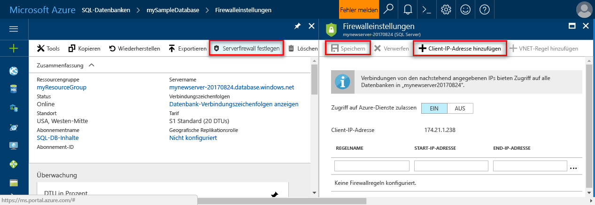

<!--
includes/sql-database-create-new-server-firewall-portal.md

Latest Freshness check:  2016-11-28 , rickbyh.

As of circa 2016-04-11, the following topics might include this include:
articles/sql-database/sql-database-get-started.md
articles/sql-database/sql-database-configure-firewall-settings
articles/sql-data-warehouse-get-started-provision.md

-->
### Erstellen Sie eine Firewallregel auf Serverebene im Azure-portal

1. Klicken Sie auf der SQL Server-Blade unter "Einstellungen" auf **Firewall** um das Blatt für die Firewall für den SQLServer zu öffnen.

    <!--  -->

2. Überprüfen Sie die Client-IP-Adresse angezeigt, und überprüfen Sie, dass dies die IP-Adresse über das Internet mit einem Browser Ihrer Wahl (Fragen "Was ist eigene IP-Adresse). Gelegentlich führen Sie eine aus verschiedenen Gründen nicht überein.

    <!--  -->

3. Vorausgesetzt, dass die IP-Übereinstimmung Adressen, klicken Sie auf **Client-IP hinzufügen** auf der Symbolleiste.

    

    > [!NOTE]
    > Sie können die SQL-Datenbank-Firewall auf dem Server eine einzelne IP-Adresse oder einen gesamten Bereich der Adressen öffnen. Öffnen die Firewall aktiviert, SQL-Administratoren und Benutzer für die Anmeldung, die auf einer beliebigen Datenbank auf dem Server, der sie gültige Anmeldeinformationen haben.
    >

4. Klicken Sie auf **speichern** auf der Symbolleiste, um diese Firewallregel auf Serverebene zu speichern, und klicken Sie dann auf **OK**.

    

> [!Tip]
> Ein Lernprogramm finden Sie unter [SQL-Datenbank-Lernprogramm: Erstellen eines Servers, einer Firewallregel auf Serverebene, eine Beispieldatenbank, eine Firewallregel auf Datenbankebene und Herstellen einer Verbindung mit SQL Server](../articles/sql-database/sql-database-get-started.md).    
>
