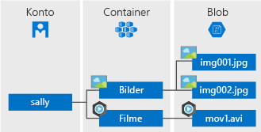

Azure Blob Storage ist die Objektspeicherlösung von Microsoft für die Cloud. Blobspeicher ist für die Speicherung großer Mengen von unstrukturierten Daten, z.B. Text oder Binärdaten, optimiert.

Blobspeicher ist für folgende Zwecke ideal geeignet:

* Speichern von Bildern oder Dokumenten direkt für einen Browser
* Speichern von Dateien für verteilten Zugriff
* Video- und Audio-Streaming
* Schreiben in Protokolldateien
* Speichern von Daten für Sicherung und Wiederherstellung, Notfallwiederherstellung und Archivierung
* Speichern von Daten für Analysen durch einen lokalen oder von Azure gehosteten Dienst

Über HTTP oder HTTPS kann von allen Orten weltweit auf Objekte zugegriffen werden, die sich in Blobspeicher befinden. Benutzer oder Clientanwendungen können über URLs, die [Azure Storage-REST-API](https://docs.microsoft.com/rest/api/storageservices/blob-service-rest-api), [Azure PowerShell](https://docs.microsoft.com/powershell/module/azure.storage), die [Azure CLI](https://docs.microsoft.com/cli/azure/storage) oder eine Azure Storage-Clientbibliothek auf Blobs zugreifen. Die Speicherclientbibliotheken sind für mehrere Sprachen verfügbar, z.B. [.NET](https://docs.microsoft.com/dotnet/api/overview/azure/storage/client), [Java](https://docs.microsoft.com/java/api/overview/azure/storage/client), [Node.js](http://azure.github.io/azure-storage-node), [Python](https://azure-storage.readthedocs.io/en/latest/index.html), [PHP](http://azure.github.io/azure-storage-php/) und [Ruby](http://azure.github.io/azure-storage-ruby).

## Konzepte des Blob-Diensts

Blobspeicher macht drei Ressourcen verfügbar: Ihr Speicherkonto, die Container im Konto und die Blobs in einem Container. Im folgenden Diagramm ist die Beziehung zwischen diesen Ressourcen dargestellt.

### Speicherkonto

Der gesamte Zugriff auf Datenobjekte erfolgt in Azure Storage über ein Speicherkonto. Weitere Informationen finden Sie unter [Informationen zu Azure-Speicherkonten](../articles/storage/common/storage-create-storage-account.md?toc=%2fazure%2fstorage%2fblobs%2ftoc.json).

### Container

Ein Container dient zum Organisieren einer Gruppe von Blobs (ähnlich wie ein Ordner in einem Dateisystem). Alle Blobs befinden sich innerhalb eines Containers. Ein Speicherkonto kann eine unbegrenzte Anzahl von Containern enthalten, und in einem Container kann eine unbegrenzte Anzahl von Blobs gespeichert werden. Beachten Sie, dass der Containername ausschließlich Kleinbuchstaben enthalten darf.

### Blob
 
Azure Storage verfügt über drei Arten von Blobs: Blockblobs, Anfügeblobs und [Seitenblobs](../articles/storage/blobs/storage-blob-pageblob-overview.md) (für VHD-Dateien).

* In Blockblobs werden Text- und Binärdaten bis zu einer Größe von ca. 4,7 TB gespeichert. Blockblobs bestehen aus Datenblöcken, die einzeln verwaltet werden können.
* Anfügeblobs bestehen wie Blockblobs auch aus Blöcken, aber sie sind für Anfügevorgänge optimiert. Anfügeblobs sind beispielsweise ideal für Szenarien, bei denen es um das Protokollieren von Daten virtueller Computer geht.
* In Seitenblobs werden Random-Access-Dateien mit einer Größe von bis zu 8 TB gespeichert. Die VHD-Dateien, die als Grundlage für VMs dienen, werden in Seitenblobs gespeichert.

Alle Blobs befinden sich innerhalb eines Containers. Ein Container ähnelt einem Ordner in einem Dateisystem. Sie können Blobs außerdem in virtuellen Verzeichnissen anordnen und wie in einem Dateisystem organisieren. 

Wenn sich die Daten besonders umfangreicher Datasets aufgrund von Netzwerkbeschränkungen nicht sinnvoll über eine Kabelverbindung in Blob Storage hochladen bzw. daraus herunterladen lassen, können Sie Festplatten an Microsoft schicken und Ihre Daten direkt in das Rechenzentrum importieren bzw. aus dem Rechenzentrum exportieren lassen. Weitere Informationen finden Sie unter [Verwenden des Microsoft Azure Import/Export-Diensts zum Übertragen von Daten in den Blobspeicher](../articles/storage/common/storage-import-export-service.md).
  
Ausführliche Informationen zum Benennen von Containern und Blobs finden Sie unter [Naming and Referencing Containers, Blobs, and Metadata](/rest/api/storageservices/Naming-and-Referencing-Containers--Blobs--and-Metadata)(Benennen von Containern, Blobs und Metadaten und Verweisen auf diese).
