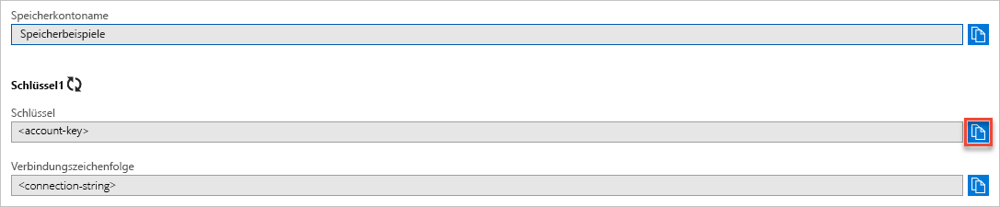

## Kopieren Ihrer Anmeldeinformationen aus dem Azure-Portal

Die Beispielanwendung muss den Zugriff auf Ihr Speicherkonto autorisieren. Stellen Sie der Anwendung die Anmeldeinformationen für Ihr Speicherkonto in Form einer Verbindungszeichenfolge bereit. So zeigen Sie die Anmeldeinformationen für Ihr Speicherkonto an:

1. Navigieren Sie zum [Azure-Portal](https://portal.azure.com).
2. Suchen Sie nach Ihrem Speicherkonto.
3. Wählen Sie im Abschnitt **Einstellungen** der Speicherkontoübersicht die Option **Zugriffsschlüssel**. Die Zugriffsschlüssel und die Verbindungszeichenfolge des Kontos werden angezeigt.
4. Notieren Sie sich den Namen Ihres Speicherkontos. Sie benötigen ihn zur Autorisierung.   
5. Suchen Sie unter **key1** nach dem Wert für **Schlüssel**, und klicken Sie dann auf die Schaltfläche **Kopieren**, um den Kontoschlüssel zu kopieren.

    
