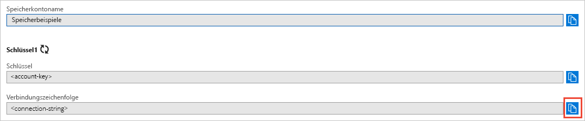

## Kopieren Ihrer Anmeldeinformationen aus dem Azure-Portal

Die Beispielanwendung muss den Zugriff auf Ihr Speicherkonto authentifizieren. Fügen Sie zum Authentifizieren der Anwendung die Anmeldeinformationen für Ihr Speicherkonto in Form einer Verbindungszeichenfolge hinzu. Führen Sie zum Anzeigen der Anmeldeinformationen Ihres Speicherkontos die folgenden Schritte aus:

1. Navigieren Sie zum [Azure-Portal](https://portal.azure.com).
2. Suchen Sie nach Ihrem Speicherkonto.
3. Wählen Sie im Abschnitt **Einstellungen** der Speicherkontoübersicht die Option **Zugriffsschlüssel**. Hier können Sie Ihre Kontozugriffsschlüssel und die vollständige Verbindungszeichenfolge für jeden Schlüssel anzeigen.   
4. Suchen Sie unter **key1** nach dem Wert für die **Verbindungszeichenfolge**, und wählen Sie dann die Schaltfläche **Kopieren**, um die Verbindungszeichenfolge zu kopieren. Der Wert der Verbindungszeichenfolge wird in einem späteren Schritt einer Umgebungsvariablen hinzugefügt.

    
