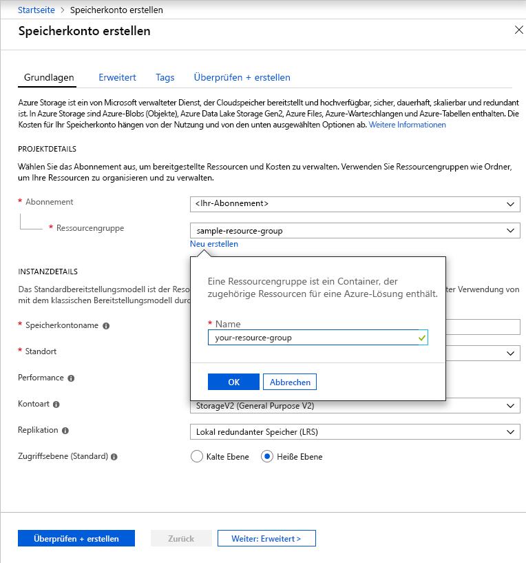

Führen Sie diese Schritte aus, wenn Sie ein allgemeines Speicherkonto vom Typ „General Purpose v2“ über das Azure-Portal erstellen möchten:

1. Erweitern Sie im Azure-Portal das Menü auf der linken Seite, um das Menü mit den Diensten zu öffnen, und klicken Sie auf **Alle Dienste**. Scrollen Sie anschließend nach unten zu **Speicher** und klicken Sie auf **Speicherkonten**. Klicken Sie im angezeigten Fenster **Speicherkonten** auf **Hinzufügen**.
1. Wählen Sie das Abonnement aus, in dem das Speicherkonto erstellt werden soll.
1. Klicken Sie unter dem Feld **Ressourcengruppe** auf **Neu erstellen**. Geben Sie einen Namen für die neue Ressourcengruppe an, wie in der folgenden Abbildung dargestellt.

    

1. Geben Sie als Nächstes einen Namen für Ihr Speicherkonto ein. Der ausgewählte Name muss in Azure eindeutig sein und zwischen 3 und 24 Zeichen aufweisen, und er darf nur Zahlen und Kleinbuchstaben enthalten.
1. Wählen Sie einen Standort für Ihr Speicherkonto aus, oder verwenden Sie den Standardstandort.
1. Behalten Sie die Standardwerte für diese Felder bei:
    - Das Feld **Bereitstellungsmodell** ist standardmäßig auf **Resource Manager** festgelegt.
    - Das Feld **Leistung** ist standardmäßig auf **Standard** festgelegt.
    - Das Feld **Kontoart** ist standardmäßig auf **StorageV2 (general-purpose v2)** festgelegt.
    - Das Feld **Replikation** ist standardmäßig auf **Lokal redundanter Speicher (LRS)** festgelegt.
    - Das Feld **Zugriffsebene** ist standardmäßig auf **Heiß** festgelegt.

1. Klicken Sie auf **Überprüfen + erstellen**, um die Speicherkontoeinstellungen zu überprüfen und das Konto zu erstellen.

Weitere Informationen zu den Arten von Speicherkonten und anderen Speicherkontoeinstellungen finden Sie unter [Übersicht über Azure Storage-Konten](https://docs.microsoft.com/azure/storage/common/storage-account-overview). Weitere Informationen zu Ressourcengruppen finden Sie unter [Übersicht über den Azure Resource Manager](https://docs.microsoft.com/azure/azure-resource-manager/resource-group-overview). 
