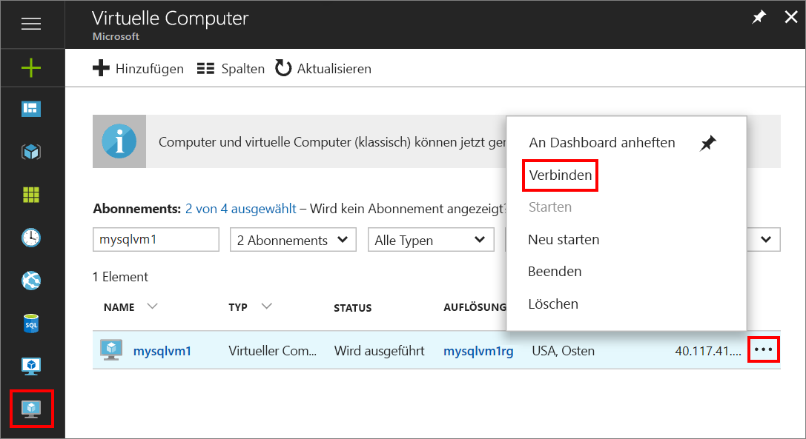
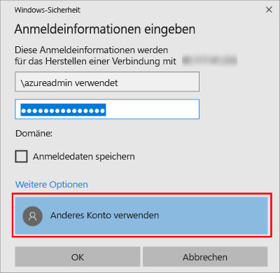

1. Wenn der virtuelle Azure-Computer erstellt wurde und ausgeführt wird, klicken Sie im Azure-Portal auf das Symbol für virtuelle Computer, um Ihre virtuellen Computer anzuzeigen.

1. Klicken Sie auf die Auslassungspunkte **...** für den neuen virtuellen Computer.

1. Klicken Sie auf **Verbinden**.

   

1. Öffnen Sie die **RDP**-Datei, die vom Browser für den virtuellen Computer heruntergeladen wird.

1. Sie werden von der Remotedesktopverbindung informiert, dass der Herausgeber dieser Remoteverbindung nicht identifiziert werden kann. Klicken Sie auf **Verbinden** , um den Vorgang fortzusetzen.

1. Klicken Sie im Dialogfeld **Windows-Sicherheit** auf **Anderes Konto verwenden**. Möglicherweise müssen Sie auf **More choices** (Weitere Optionen) klicken, um diese Option anzuzeigen. Geben Sie den Benutzernamen und das Kennwort an, den bzw. das Sie bei der Erstellung des virtuellen Computers konfiguriert haben. Sie müssen einen umgekehrten Schrägstrich vor dem Benutzernamen einfügen.

   

1. Klicken Sie auf **OK**, um eine Verbindung herzustellen.
