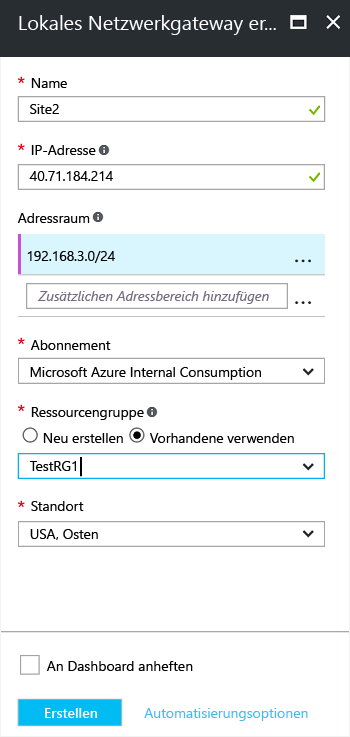

1. Im Portal aus **alle Ressourcen**, klicken Sie auf **+ Add**. 
2. In der **alles** Blatt Suchfeld, geben **Gateway des lokalen Netzwerks**, klicken Sie auf Suchen. Dieser Befehl eine Liste zurück. Klicken Sie auf **Gateway des lokalen Netzwerks** um das Blatt zu öffnen, klicken Sie dann auf **erstellen** So öffnen die **erstellen lokalen Netzwerkgateway** Blatt.

  

3. Auf der **erstellen LAN Gateway Blatt**, geben Sie die Werte für Ihr lokales Netzwerk-Gateway.

  - **Name:** Geben Sie einen Namen für Ihr lokales Netzwerk-Gateway-Objekt.
  - **IP-Adresse:** Dies ist die öffentliche IP-Adresse des VPN-Geräts, das Azure für die Verbindung verwendet werden soll. Geben Sie eine gültige öffentliche IP-Adresse ein. Die IP-Adresse darf nicht hinter NAT sein und muss durch Azure erreichbar sein. Wenn Sie zurzeit nicht über die IP-Adresse verfügen, können Sie die Werte im Screenshot dargestellt, aber Sie müssen zurückgehen, und Ersetzen Sie die Platzhalter-IP-Adresse mit der öffentlichen IP-Adresse Ihres VPN-Geräts. Andernfalls wird Azure herstellen können nicht.
  - **Adressraum** bezieht sich auf die Adressbereiche für das Netzwerk, das dieses lokale Netzwerk darstellt. Sie können mehrere Adressbereiche Speicherplatz hinzufügen. Stellen Sie sicher, dass die hier angegebenen Bereiche nicht mit Adressbereichen von anderen Netzwerken überschneiden, die Sie herstellen möchten. Azure leitet den Adressbereich, den Sie angeben, die IP-Adresse einer lokalen VPN-Geräts. *Verwenden Sie Ihre eigenen Werte hier nicht die Werte, die im Screenshot gezeigten*.
  - **Abonnement:** überprüfen, der das richtige Abonnement angezeigt wird.
  - **Ressourcengruppe:** wählen Sie die Ressourcengruppe, die Sie verwenden möchten. Sie können entweder eine neue Ressourcengruppe erstellen, oder wählen Sie eine, die Sie bereits erstellt haben.
  - **Ort:** wählen Sie den Speicherort an, die in dieses Objekt erstellt werden. Empfiehlt es sich um den gleichen Speicherort auszuwählen, dem Ihrem VNet befindet, jedoch nicht dazu erforderlich sind.

4. Wenn Sie die Werte ausgewählt haben, klicken Sie auf **erstellen** unten auf dem Blatt ", um das Gateway des lokalen Netzwerks zu erstellen.